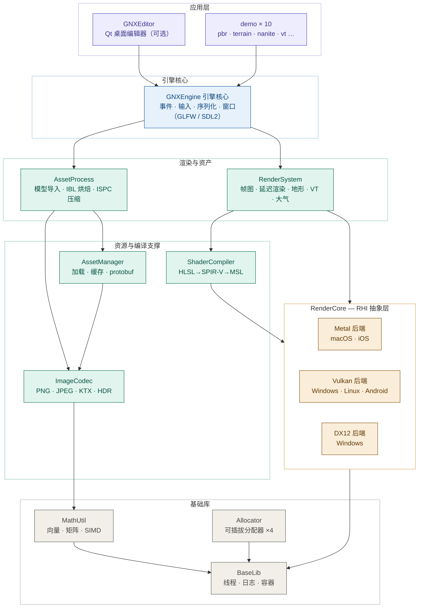

# GNXEngine

轻量级跨平台游戏引擎，使用 C++20 开发，CMake 构建，支持 **Windows / macOS / Linux**，并已打通 **iOS / Android** 交叉编译与真机运行验证。

## 特性

- **跨平台 RHI**：图形 API 兼容 Metal、Vulkan和DX12
- **自主基础设施**：多线程、线程池、时间、日期、日志、字符串等基础功能
- **自主数学库**：向量、矩阵、四元数等 3D 数学运算
- **资源导入**：使用 Assimp 导入静态网格、蒙皮网格及动画资源；支持 PNG/JPEG/TGA/KTX1 纹理格式
- **PBR/IBL 渲染**：基于物理的渲染与基于图像的光照
- **动画系统**：动画姿态插值、CPU/GPU 蒙皮，优化了局部到全局变换的转换
- **HLSL Shader 管线**：DXC → SPIR-V → Spirv-Cross → 各后端 Shader 语言
- **Mesh Shader**：支持 Task + Mesh Shader 管线（Metal / Vulkan）
- **Entity-Component 架构**：传统的 Entity-Component 模式构造上层业务

## 平台支持

### 图形后端

| 平台 | 图形后端 | 窗口系统 | 说明 |
|------|---------|---------|------|
| **macOS** | Metal | GLFW | 原生 Metal 渲染 |
| **iOS** | Metal | SDL2 | 原生 Metal 渲染（真机可运行） |
| **Windows** | Vulkan DX12 | GLFW | — |
| **Linux** | Vulkan | GLFW | — |
| **Android** | Vulkan | SDL2 | 原生 Vulkan 渲染（真机可运行） |

## 架构



*模块依赖严格单向（上层 → 下层），全仓无循环依赖；平台裁剪在 CMake 层完成。*

### 核心模块说明

| 模块 | 说明 | 依赖 |
|------|------|------|
| **GNXEngine** | 引擎核心库，事件系统、输入、序列化（窗口：GLFW/SDL2） | RenderSystem, AssetProcess, AssetManager, Allocator |
| **RenderSystem** | 渲染系统上层，场景、相机、光照、帧图、后处理 | RenderCore, ShaderCompiler |
| **AssetProcess** | 资源处理，模型导入(Assimp)、IBL、纹理压缩转换 | RenderSystem, AssetManager, ImageCodec |
| **AssetManager** | 资源管理器，资源加载、缓存、生命周期 | ImageCodec |
| **RenderCore** | RHI 抽象层，GPU 资源与操作接口，Metal/Vulkan/DX12 三后端 | BaseLib |
| **ShaderCompiler** | Shader 编译管线，HLSL → SPIR-V → MSL/SPIR-V/DXIL | RenderCore |
| **ImageCodec** | 图像编解码，PNG/JPEG/TGA/KTX | MathUtil |
| **MathUtil** | 3D 数学库，向量、矩阵、四元数 | BaseLib |
| **Allocator** | 内存分配器 | BaseLib |
| **BaseLib** | 基础库，多线程、线程池、日志、时间、字符串 | — |

## 编译

### 前置要求

#### 必装工具

| 工具 | 版本要求 | 说明 |
|------|---------|------|
| **CMake** | 3.17+ | 构建系统 |
| **C++20 编译器** | — | macOS: Xcode Command Line Tools；Windows: MSVC 2019+；Linux: GCC 10+ / Clang 12+ |
| **PowerShell / curl + unzip** | — | 用于自动拉取依赖（见下文） |

> **注**：Linux 编译还需安装 Vulkan SDK（渲染后端）与 X11/Wayland 开发库（GLFW 窗口依赖）。

#### 自动拉取依赖（推荐）

无需手动安装 ISPC。首次构建前运行仓库根目录下的脚本，即可自动下载并解压构建工具（含 ISPC）到 `buildtools/`，CMake 会自动从 `buildtools/ispc/{win|mac|linux}/ispc` 找到它：

**Windows：**

```powershell
# 在仓库根目录下运行
./fetch-deps.ps1

# 可选：自定义下载地址 / 解压目录
./fetch-deps.ps1 -Url "https://..." -DestDir "C:\buildtools"
```

**macOS / Linux：**

```bash
# 在仓库根目录下运行
./fetch-deps.sh

# 可选：自定义下载地址 / 解压目录
./fetch-deps.sh "https://..." "$PWD/buildtools"
```

> **注**：macOS 上 `fetch-deps.sh` 会自动检测系统代理（`scutil --proxy`），确保下载速度与 Windows 一致。下载内容会校验是否为有效归档，解压后会统一恢复可执行权限。

#### 可选依赖（仅编辑器）

| 工具 | 说明 |
|------|------|
| **Qt6** (或 Qt5) | 编辑器所需，仅需 Widgets 模块，编译时加 `-DENABLE_EDITOR=ON`；Linux 需额外安装 `qtbase5-dev` / `libqt6widgets6` |

#### 已内嵌的依赖

以下依赖已在 `ThirdParty/` 目录中，无需单独安装：

DXC (Shader 编译), Assimp (模型导入), SPIRV-Reflect, TBB, GLFW, SDL2 (iOS/Android 窗口), KTX, nlohmann_json, nanopb, yaml-cpp, mimalloc, meshoptimizer, zlib, miniz, pvrtc, Vulkan Headers

### 编译步骤

```bash
# 生成构建文件
cmake -B build

# 编译
cmake --build build --config Debug
```

### 编译选项

通过 `-D` 参数控制可选模块的编译：

| 选项 | 说明 | 默认值 |
|------|------|--------|
| `ENABLE_EDITOR` | 编译编辑器（需安装 Qt） | OFF |
| `ENABLE_TESTING` | 编译单元测试 | OFF |
| `ENABLE_EDITOR_TESTS` | 编译编辑器测试（仅编辑器开启时） | `ENABLE_TESTING` |
| `ENABLE_EDITOR_SANDBOX` | 编译独立渲染实验窗口 | OFF |

示例：

```bash
# 编译全部模块（含编辑器和测试）
cmake -B build -DENABLE_EDITOR=ON -DENABLE_TESTING=ON

# 仅编译编辑器
cmake -B build -DENABLE_EDITOR=ON

# 编译正式编辑器目标
cmake --build build --config Debug --target GNXEditor

# 可选：编译隔离的渲染实验入口（不会进入 GNXEditor）
cmake -B build -DENABLE_EDITOR=ON -DENABLE_EDITOR_SANDBOX=ON
cmake --build build --config Debug --target GNXEditorRenderSandbox

# 运行编辑器基础架构测试
cmake -B build -DENABLE_EDITOR=ON -DENABLE_TESTING=ON
cmake --build build --config Debug --target GNXEditorTests
ctest --test-dir build -C Debug --output-on-failure

# 运行无交互启动/渲染/退出验证
build\Debug\GNXEditor.exe --smoke-test
build\Debug\GNXEditorRenderSandbox.exe --smoke-test

# 生成可分发的编辑器目录（Windows 会部署 Qt 运行库和插件）
cmake --install build --config Release --prefix build/install

# 验证不含 Qt 和编辑器代码的 Runtime-only 构建
cmake -B build-runtime -DENABLE_EDITOR=OFF -DENABLE_TESTING=ON
cmake --build build-runtime --config Debug
ctest --test-dir build-runtime -C Debug --output-on-failure

# 编译并运行单元测试
cmake -B build -DENABLE_TESTING=ON
cmake --build build
cd build && ctest
```

### Demo

编译后在 `build/Debug/` 目录下可直接运行各 Demo：

- `pbr` — PBR 渲染示例
- `terrain` — 地形渲染
- `meshshader` — Mesh Shader 示例
- `ssao` — 屏幕空间环境光遮蔽
- `lumen` / `nanite` — 实验性功能
