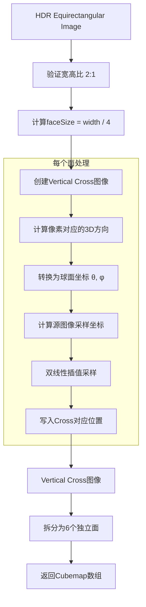

# HDR环境贴图转换：从等距圆柱投影到Cubemap的完整实现


> **注意**：本文代码示例中使用的类（如 `VImage`、`Vector3f`、`Vector2i` 等）为项目自定义实现。读者在参考实现时，请根据自己项目的实际情况替换为相应的图像类和数学类。

## 一、背景与动机

在现代实时渲染中，**环境贴图（Environment Map）** 是实现基于图像的光照（IBL）的核心技术。无论是反射、折射还是环境光遮蔽，都需要高质量的环境贴图作为输入。

然而，环境贴图有多种存储格式，最常见的有：

| 格式 | 优点 | 缺点 | 应用场景 |
|------|------|------|----------|
| **Equirectangular** | 单一纹理，存储方便 | 极点畸变，采样不均匀 | HDR采集、存储 |
| **Cubemap** | 采样均匀，GPU友好 | 需要6个面 | 实时渲染 |
| **Vertical Cross** | 单文件，可视化友好 | 非标准GPU格式 | 工具链、预览 |

本文将深入分析如何将 **Equirectangular格式** 的HDR环境贴图转换为 **Vertical Cross格式**，再拆分为独立的Cubemap面。

---

## 二、数学基础：球面坐标与投影

### 2.1 Equirectangular投影原理

Equirectangular投影是最简单的球面投影，将球面坐标 (θ, φ) 直接映射到纹理坐标 (u, v)：

```
u = (θ + π) / (2π)
v = (π/2 - φ) / π
```

其中：
- θ 是经度（longitude），范围 [-π, π]
- φ 是纬度（latitude），范围 [-π/2, π/2]

这种投影的**致命缺陷**是极点附近的严重畸变：极点区域被拉伸成整个水平线，而赤道区域相对正常。这导致采样密度不均匀。

### 2.2 球面坐标与笛卡尔坐标的转换

为了在两种投影之间转换，我们需要理解球面坐标与笛卡尔坐标的关系：

**笛卡尔坐标 → 球面坐标：**

```
x = r × cos(φ) × cos(θ)
y = r × sin(φ)
z = r × cos(φ) × sin(θ)
```

**球面坐标 → 笛卡尔坐标（逆变换）：**

```
r = sqrt(x² + y² + z²)
θ = atan2(z, x)
φ = atan2(y, sqrt(x² + z²))
```

这些公式是整个转换算法的核心。

---

## 三、Cubemap的几何结构

### 3.1 六面定义

Cubemap将球面映射到一个单位立方体的六个面：

```cpp
static Vector3f FaceCoordsToXYZ(uint32_t i, uint32_t j, uint32_t faceID, uint32_t faceSize)
{
    const float A = 2.0f * float(i) / faceSize;
    const float B = 2.0f * float(j) / faceSize;

    if (faceID == 0) return Vector3f(-1.0f, A - 1.0f, B - 1.0f);      // +X
    if (faceID == 1) return Vector3f(A - 1.0f, -1.0f, 1.0f - B);      // -X
    if (faceID == 2) return Vector3f(1.0f, A - 1.0f, 1.0f - B);       // +Y
    if (faceID == 3) return Vector3f(1.0f - A, 1.0f, 1.0f - B);       // -Y
    if (faceID == 4) return Vector3f(B - 1.0f, A - 1.0f, 1.0f);       // +Z
    if (faceID == 5) return Vector3f(1.0f - B, A - 1.0f, -1.0f);      // -Z

    return Vector3f();
}
```

这段代码的含义是：给定一个面的ID和像素坐标 \((i, j)\)，计算出对应的3D方向向量。

**关键洞察**：每个像素代表一个从原点出发的方向向量，最终会延伸到球面交点。

### 3.2 为什么是这些公式？

以 `faceID == 0`（+X面）为例：

```
      +Y
       |
       |
       |________ +Z
      /
     /
    +X (我们在这里)
```

当我们在+X面上时：
- X坐标固定为 -1（为什么是-1？因为后面会归一化）
- Y坐标从 -1 到 +1 对应像素的列方向
- Z坐标从 -1 到 +1 对应像素的行方向

```
A = 2.0f * i / faceSize  // 从0到2，减1后从-1到+1
B = 2.0f * j / faceSize  // 同上
```

### 3.3 Vertical Cross布局

Vertical Cross是一种将6个面排列成十字形的方式：

```
        ------
        | +Y |
   ----------------
   | -X | -Z | +X |
   ----------------
        | -Y |
        ------
        | +Z |
        ------
```

在代码中，每个面的偏移位置定义为：

```cpp
const Vector2i kFaceOffsets[] =
{
    Vector2i(faceSize, faceSize * 3),     // +X
    Vector2i(0, faceSize),                // -X
    Vector2i(faceSize, faceSize),         // +Y
    Vector2i(faceSize * 2, faceSize),     // -Y
    Vector2i(faceSize, 0),                // +Z
    Vector2i(faceSize, faceSize * 2)      // -Z
};
```

---

## 四、转换算法详解

### 4.1 整体流程

```
┌─────────────────────┐
│  Equirectangular    │
│  (2:1 宽高比)        │
└──────────┬──────────┘
           │ ConvertEquirectangularMapToVerticalCross()
           ▼
┌─────────────────────┐
│   Vertical Cross    │
│   (3:4 宽高比)       │
└──────────┬──────────┘
           │ ConvertVerticalCrossToCubeMapFaces()
           ▼
┌─────────────────────┐
│   6个独立的面图像     │
│   (faceSize² each)  │
└─────────────────────┘
```

### 4.2 核心转换逻辑

```cpp
for (uint32_t face = 0; face != 6; face++)
{
    for (uint32_t i = 0; i != faceSize; i++)
    {
        for (uint32_t j = 0; j != faceSize; j++)
        {
            // Step 1: 计算当前像素对应的3D方向
            const Vector3f P = FaceCoordsToXYZ(i, j, face, faceSize);
            
            // Step 2: 转换为球面坐标
            const float R = hypot(P.x, P.y);
            const float theta = atan2(P.y, P.x);  // 经度
            const float phi = atan2(P.z, R);       // 纬度
            
            // Step 3: 计算源图像的采样坐标
            const float Uf = float(2.0f * faceSize * (theta + M_PI) / M_PI);
            const float Vf = float(2.0f * faceSize * (M_PI / 2.0f - phi) / M_PI);
            
            // Step 4: 双线性插值采样
            // ...
        }
    }
}
```

### 4.3 坐标公式的数学推导

**从球面坐标到Equirectangular UV**：

1. 经度范围 [-π, π] 映射到U范围 [0, 4 × faceSize]
2. 纬度范围 [-π/2, π/2] 映射到V范围 [0, 2 × faceSize]

```cpp
Uf = 2.0f * faceSize * (theta + M_PI) / M_PI;
Vf = 2.0f * faceSize * (M_PI / 2.0f - phi) / M_PI;
```

数学验证：
- 当 θ = -π 时，Uf = 0
- 当 θ = π 时，(θ + π) / π = 2，所以 Uf = 4 × faceSize
- 当 φ = π/2 时，Vf = 0（北极）
- 当 φ = -π/2 时，Vf = 2 × faceSize（南极）

---

## 五、双线性插值：高质量重采样

### 5.1 为什么需要插值？

直接取最近邻像素会导致严重的锯齿和artifacts。双线性插值通过对相邻四个像素进行加权平均，产生更平滑的结果。

### 5.2 实现代码

```cpp
// 4-samples for bilinear interpolation
const uint32_t U1 = clamp(uint32_t(floor(Uf)), 0u, clampW);
const uint32_t V1 = clamp(uint32_t(floor(Vf)), 0u, clampH);
const uint32_t U2 = clamp(U1 + 1, 0u, clampW);
const uint32_t V2 = clamp(V1 + 1, 0u, clampH);

// fractional part
const float s = Uf - U1;
const float t = Vf - V1;

// fetch 4-samples
const Vector4f A = envImage->GetPixel(U1, V1);
const Vector4f B = envImage->GetPixel(U2, V1);
const Vector4f C = envImage->GetPixel(U1, V2);
const Vector4f D = envImage->GetPixel(U2, V2);

// bilinear interpolation
const Vector4f color = A * (1 - s) * (1 - t) 
                     + B * (s) * (1 - t) 
                     + C * (1 - s) * t 
                     + D * (s) * (t);
```

### 5.3 插值权重可视化

```
(U1,V1)────(U2,V1)
   │    s    │
   │  A───B  │
   │  │  *│  │  ← 目标采样点
   │  C───D  │
   │         │
(U1,V2)────(U2,V2)

权重计算：
- A的权重 = (1-s)(1-t)  ← 左上
- B的权重 = s(1-t)      ← 右上
- C的权重 = (1-s)t      ← 左下
- D的权重 = st          ← 右下
```

---

## 六、Vertical Cross到独立面的转换

### 6.1 布局映射

```cpp
/*
        ------
        | +Y |
   ----------------
   | -X | -Z | +X |
   ----------------
        | -Y |
        ------
        | +Z |
        ------
*/
```

每个面在Cross图像中的位置：

| Face | OpenGL枚举 | 在Cross中的位置 | 大小 |
|------|-----------|----------------|------|
| +X | `GL_TEXTURE_CUBE_MAP_POSITIVE_X` | 第2列第1行 | faceSize × faceSize |
| -X | `GL_TEXTURE_CUBE_MAP_NEGATIVE_X` | 第0列第1行 | faceSize × faceSize |
| +Y | `GL_TEXTURE_CUBE_MAP_POSITIVE_Y` | 第1列第0行 | faceSize × faceSize |
| -Y | `GL_TEXTURE_CUBE_MAP_NEGATIVE_Y` | 第1列第2行 | faceSize × faceSize |
| +Z | `GL_TEXTURE_CUBE_MAP_POSITIVE_Z` | 第1列第3行 | faceSize × faceSize |
| -Z | `GL_TEXTURE_CUBE_MAP_NEGATIVE_Z` | 第1列第1行 | faceSize × faceSize |

### 6.2 坐标变换的复杂性

关键在于：**每个面的UV方向可能不同**。

OpenGL的Cubemap约定：
- 每个面有自己的坐标系
- UV方向可能需要翻转以匹配GPU的期望

```cpp
switch (face)
{
    // GL_TEXTURE_CUBE_MAP_POSITIVE_X
case 0:
    x = i;
    y = faceHeight + j;
    break;

    // GL_TEXTURE_CUBE_MAP_NEGATIVE_X
case 1:
    x = 2 * faceWidth + i;
    y = 1 * faceHeight + j;
    break;

    // GL_TEXTURE_CUBE_MAP_POSITIVE_Y
case 2:
    x = 2 * faceWidth - (i + 1);  // 注意：X方向翻转
    y = 1 * faceHeight - (j + 1); // 注意：Y方向翻转
    break;
    
    // ... 其他面
}
```

**为什么有些面需要翻转？**

这是因为OpenGL的Cubemap坐标系约定与Cross布局的坐标系不一致。例如，+Y面在OpenGL中要求：
- U轴指向-X方向
- V轴指向-Z方向

但在Cross布局中，图像的自然方向可能不同，因此需要翻转。

---

## 七、性能优化考量

### 7.1 内存预分配

```cpp
// 预分配并清零
result->SetImageInfo(envImage->GetFormat(), w, h);
result->AllocPixels();
memset(result->GetImageData(), 0, w * h * 4 * 3);  // RGB32Float = 12 bytes
```

### 7.2 边界Clamp优化

```cpp
const uint32_t clampW = envImage->GetWidth() - 1;
const uint32_t clampH = envImage->GetHeight() - 1;

// 在循环中
const uint32_t U1 = clamp(uint32_t(floor(Uf)), 0u, clampW);
```

预先计算clamp边界，避免每次调用 `GetWidth() - 1`。

### 7.3 可能的优化方向

1. **并行化**：每个面的处理是独立的，可以用多线程
2. **SIMD**：双线性插值的四个权重计算可以向量化
3. **GPU加速**：整个转换可以用Compute Shader实现
4. **Mipmap预生成**：一次性生成所有mip层级

---

## 八、总结

### 8.1 核心要点

1. **坐标变换是核心**：理解球面坐标、笛卡尔坐标、纹理坐标之间的转换
2. **双线性插值保证质量**：避免锯齿和artifacts
3. **方向一致性很重要**：Cubemap面的UV方向必须与GPU约定一致

### 8.2 完整流程图



### 8.3 实际应用场景

- **IBL（Image-Based Lighting）**：将HDR环境贴图转换为Cubemap用于实时反射
- **天空盒**：从HDR生成天空盒纹理
- **预过滤环境贴图**：生成不同粗糙度的预过滤Cubemap用于PBR

---

## 九、参考资料

1. [OpenGL Cubemap Specification](https://www.khronos.org/opengl/wiki/Cubemap_Texture)
2. [Equirectangular Projection - Wikipedia](https://en.wikipedia.org/wiki/Equirectangular_projection)
3. [IBL Specular - learnopengl.com](https://learnopengl.com/PBR/IBL/Specular-IBL)


