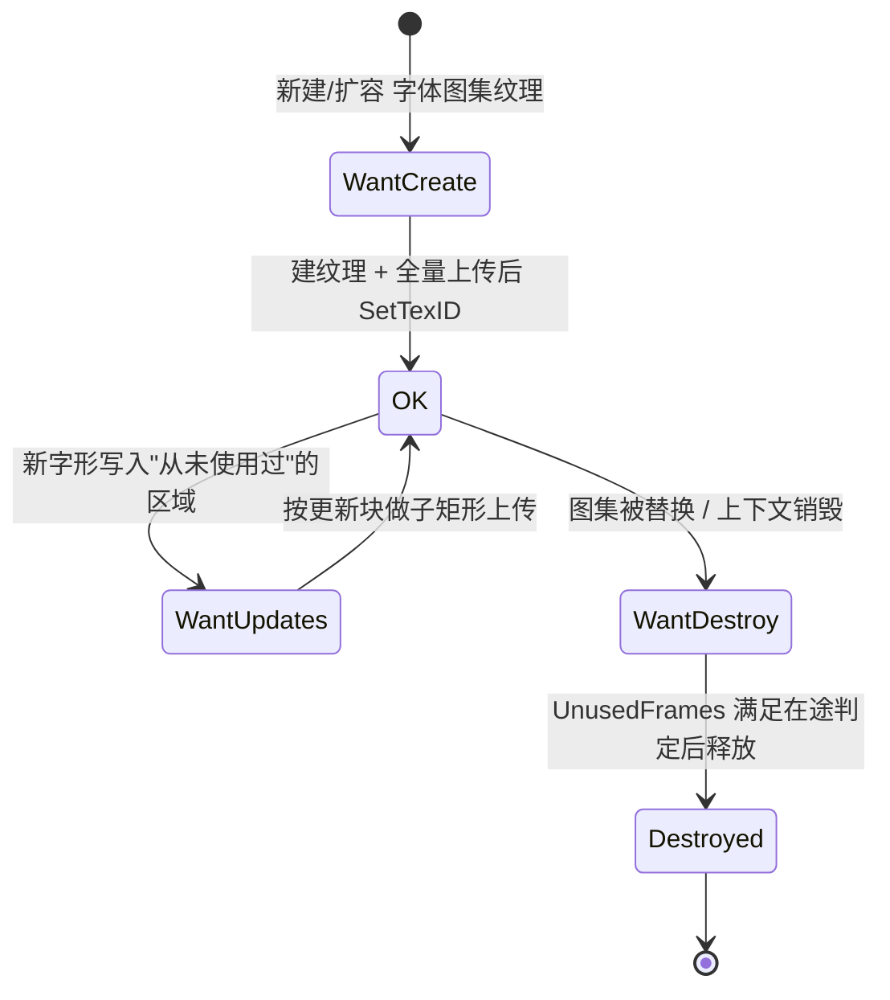

# Dear ImGui 1.91.9b → 1.92.9b 升级可行性 / 风险评估

> **状态更新（2026-09-12）**：本报告的建议**已实施完毕并通过验证**，目标版本 v1.92.9b。
> 实施细节、与本文方案的偏差、踩坑记录与验证结果见 **§11 实施结果** —— 凡有出入之处**以 §11 为准**
> （尤其 §11.2 对 DPI 方案的修正）。
>
> **文档性质**：本文主体为升级实施前编写的评估报告，所有"改造点"均以「若升级则需修改」的措辞表述。
>
> **行号基线声明**：文中 `文件:行号` 均基于当前 `1.91.9b` 集成状态的代码快照。
> 代码一旦变动（包括本次文档同步之外的任何提交），引用行号需重新核对。
>
> **置信度标注约定**：正文结论默认"已确证"；凡引自非一手渠道或无法逐字确证者，
> 一律标注 `【待核实】` 并在 §10.3 汇总核实路径，**不以推测充当结论**。

---

## 1. 结论摘要

**结论：可以进行升级，且建议升级。推荐目标版本 v1.92.9b。**

| 维度 | 结论 |
|---|---|
| 可行性 | **可行**。1.92.9b 的核心文件集与当前完全一致（11 个文件），`ThirdParty/imgui/CMakeLists.txt` 的源码列表**无需修改**；引擎只通过 `ImGuiRenderer.cpp` 一处集中调用 ImGui，且业务代码**不使用** `ImDrawList` 直绘 API，破坏面收敛 |
| 是否解决原始痛点 | **是**。1.92 起字形按需光栅化，`GetGlyphRangesXXX()` 全部废弃、`ImFontGlyphRangesBuilder` 官方明确"不再真正有用"——`AddGlyphText()` 这类注册步骤可**彻底删除** |
| 推荐版本 | **v1.92.9b**（2026-07-31，最新正式版，`IMGUI_VERSION_NUM 19291`）。不建议跟随 master 的 1.93.0 WIP |
| 总体风险等级 | **中低**。两个高风险点需重点关注：① `ImDrawData::CmdListsCount` 的静默失效（表现为 UI 完全不渲染）；② Vulkan `ReplaceRegion` 非 host-image-copy 路径（引擎注释自承异步逻辑存在问题） |
| 工作量估算 | 约 **1.5 ~ 2.5 人日**（含双后端验证），建议分 3 步实施（见 §9） |
| 回滚成本 | **低**。改动集中在 `ThirdParty/imgui/imgui/` 目录替换 + `ImGuiRenderer.h/.cpp` + demo 一处调用，打 tag 后 `git revert` 即可 |
| 时效性理由 | 官方在 `docs/BACKENDS.md` 中声明该纹理能力标志"很可能在 2026 年 6 月前成为所有后端的必需项"，当前为 2026 年 9 月，继续停留在 1.91 会被迫在更晚的时间点被动迁移 |

**一句话建议**：升级收益（彻底免除字形注册、任意字号、Retina 清晰度自动化）明显大于代价（渲染后端新增约 60~80 行纹理协议 + 若干 API 清理），建议尽快实施。

---

## 2. 现状基线

### 2.1 版本与文件集

| 项 | 现状 | 证据 |
|---|---|---|
| 版本 | `"1.91.9b"`，`IMGUI_VERSION_NUM 19191` | `ThirdParty/imgui/imgui/imgui.h:31-32` |
| 核心文件 | 11 个：4 个 `.cpp` + 6 个 `.h` + `LICENSE.txt` | `ThirdParty/imgui/imgui/` |
| 1.92.9b 文件集 | **与当前完全一致** | 官方 tag `v1.92.9b` 根目录清单 |
| `imconfig.h` | **原版未改**（除 `#pragma once` 外所有自定义项均为注释状态） | `ThirdParty/imgui/imgui/imconfig.h:15`，全文仅此一处生效语句 |
| CMake | 桌面 SHARED / 移动 STATIC；`CXX_VISIBILITY_PRESET default`；`DEBUG_POSTFIX ""` | `ThirdParty/imgui/CMakeLists.txt:35-58` |
| 官方 backends | **未引入**（源列表仅 4 个核心 cpp） | `ThirdParty/imgui/CMakeLists.txt:14-19` |

### 2.2 ImGui 使用点全量清单（排除 `ThirdParty/imgui/**`）

**除第三方库外，ImGui 仅集中在下列 6 个文件**（其中 `ImGuiRenderer.h/.cpp` 属同一模块，实际业务使用点为 4 处引擎文件 + 1 个 demo）：

| 文件 | 行号 | 作用 |
|---|---|---|
| `Engine/Runtime/RenderSystem/include/UI/ImGuiRenderer.cpp` | 全文 | 自研 RHI 渲染后端 + 输入桥接（核心） |
| `Engine/Runtime/RenderSystem/include/UI/ImGuiRenderer.h` | 全文 | 接口声明 |
| `Engine/Runtime/GNXEngine/source/AppFrameWork.cpp` | 105-129, 141-151 | `NewFrame` 驱动、`OnEvent` 优先消费 |
| `Engine/Runtime/RenderSystem/source/SceneManager.cpp` | 572-591 | 懒创建 `ImGuiRenderer` |
| `Engine/Runtime/RenderSystem/source/DeferredSceneRenderer.cpp` | 557-560 | 调用 `Render(renderEncoder)` |
| `demo/atmosphere/AtmosphereFrameWork.cpp` | 46-59 | `AddGlyphText` / `SetDPIScale` / `InvalidateFontAtlas` |

**关键排除项（经全量检索确认为 0 匹配）**：业务/demo 侧**不存在** `ImDrawList` 绘制 API
（`AddRect` / `AddPolyline` / `PathStroke` / `AddCircle` / `AddImage` / `PushTextureID` / `ImDrawFlags_*`），
也**不存在** `PushFont` / `SetWindowFontScale` / `GetWindowDrawList`。

> 这一点意义重大：1.92.8 被称为"史上最糟糕的破坏性变更"的 `AddRect/AddPolyline/PathStroke` **参数顺序调整**、
> 以及 `PushFont()` 必填 size 的签名变更，对本项目**零影响**。

### 2.3 引擎侧能力基线（决定动态图集能否落地）

**纹理创建**（`Engine/Runtime/RenderCore/include/RenderDevice.h:160-164`）：

```cpp
virtual RCTexture2DPtr CreateTexture2D(TextureFormat format, TextureUsage usage,
                                       uint32_t width, uint32_t height, uint32_t levels) const = 0;
```

实现：Metal `MTLRenderDevice.mm:203-248`；Vulkan `VKRenderDevice.cpp:499`。

**子矩形局部更新**（`RCTexture.h:94-97`）：`ReplaceRegion(const Rect2D&, uint32_t level, const uint8_t* bytes, uint32_t bytesPerRow)`

| 后端 | 是否支持子矩形 | 机制与约束 |
|---|---|---|
| Metal | ✅ | `MTLRegionMake3D(rect.offsetX, rect.offsetY, 0, rect.width, rect.height, 1)` → `replaceRegion:`（`MTLTextureBase.mm:61-128`）。约束：`bytesPerRow ≥ 64`（`kMinBytesPerRowAlignment=64`，`:15`），不足时逐行 padding（`:95-128`）。图集宽度 ≥ 512 → `bytesPerRow ≥ 2048`，**不触发 padding 分支** |
| Vulkan | ✅ | 两分支：① 支持 host image copy 时 `vkTransitionImageLayoutEXT` + `vkCopyMemoryToImageEXT` 直接 host→image（`VKTextureBase.cpp:300-376`）；② 否则 **staging buffer + 异步上传**（`:377-408`），**该分支源码注释自承"异步加载逻辑还有问题"** |

**纹理尺寸上限**：`CreateTexture2D` **两端均不校验** `maxTextureSize2D`
（Metal 仅查 `width/height/levels==0`：`MTLRenderDevice.mm:216-220`；Vulkan 同：`VKRenderDevice.cpp:505-509`）。
上限值由后端填充（`RenderDeviceFeatures.h:52`）：Metal macOS 档位 **16384**（`:552,565`），
iOS 兜底档 **4096**（`:629`）；Vulkan 取 `props.limits.maxImageDimension2D`（`:172`）。

**纹理生命周期与在途帧回收（两端不对称）**：

| 后端 | 释放机制 | 关键事实 |
|---|---|---|
| Vulkan | `VulkanGarbageCollector::QueueImageDestruction(..., framesToDelay=2)` + timeline semaphore 判定安全帧 | `VKTextureBase.cpp:229`、`VulkanContext.cpp:1064-1077`、`VulkanGarbageCollector.h:64,97,153` |
| Metal | **无延迟销毁队列**，`~MTLTextureBase` 为空，依赖 ARC 立即释放 | `MTLTextureBase.mm:57-59` |

**帧并发**：Vulkan 实际帧槽 = **swapchain image count**（非固定 3）；
`MAX_FRAMES_IN_FLIGHT = 3` 仅用于描述符集槽位（`VKShaderFunction.cpp:328`）；
每帧槽位在帧首 `vkWaitForFences`（5s 超时）阻塞（`VKRenderDevice.cpp:705,817-819,1022`）。

**UI 渲染位置与采样**：`DeferredSceneRenderer.cpp:556-559`，位于 `mPostProcessing->Process()` 之后、
`EndRenderPass` 之前，复用同一 encoder 叠加。采样器默认 `MAG_LINEAR / MIN_LINEAR / CLAMP_TO_EDGE`
（`RenderDescriptor.h:174-179`，代码层面以 `SamplerDesc` 成员初始值为准）——
**与官方对字体纹理"必须双线性过滤"的要求一致**。

> 注：`RenderCore/include/TextureSampler.h:22-29` 的注释声称默认值为 `NEAREST`，与 `SamplerDesc`
> 的实际成员初始值（`MAG_LINEAR`/`MIN_LINEAR`）不符，属引擎侧注释陈旧的既有问题，
> 与本升级无关，但查阅时勿被该注释误导。

---

## 3. 变更影响映射表

### 3.1 分类 A：必然的编译错误（必须修改）

| # | 位置 | 现状代码 | 1.92 变化 | 处理方式 |
|---|---|---|---|---|
| A1 | `ImGuiRenderer.cpp:396` | `(int)io.Fonts->Fonts[0]->Glyphs.Size` | `ImFont::Glyphs` 已迁至 `ImFontBaked`（`ImFontBaked` 仅当前帧有效） | 改为 `font->GetFontBaked(size)->Glyphs.Size`，或直接删除该日志字段 |
| A2 | `ImGuiRenderer.h:81-87, 141` | `AddGlyphText()` / `mExtraGlyphText` | 字形范围机制整体废弃 | **按决策直接删除**（含 demo 调用） |
| A3 | `ImGuiRenderer.h:93, 137` | `InvalidateFontAtlas()` / `mFontTextureDirty` | 动态字体无需"重建图集" | **按决策直接删除**（含 demo 调用） |

### 3.2 分类 B：废弃（obsolete）重定向——编译可通过，但语义/行为已变

> `Build()` / `GetTexDataAsRGBA32()` / `GetTexDataAsAlpha8()` / `SetTexID()` / `IsBuilt()`
> 在 1.92.9b **仍以 obsolete 重定向形式保留**（`docs/BACKENDS.md` 明确列为 obsoleted），
> 但在定义 `IMGUI_DISABLE_OBSOLETE_FUNCTIONS` 时**会消失**（进而变成编译错误）。

| # | 位置 | 现状代码 | 处理方式 |
|---|---|---|---|
| B1 | `ImGuiRenderer.cpp:475-478` | `if (!io.Fonts->IsBuilt()) io.Fonts->Build();` | 删除。**官方警告：在新后端初始化前调用 `Build()` 会错误地预加载全部字形，并会触发断言** |
| B2 | `ImGuiRenderer.cpp:410-413` | `io.Fonts->GetTexDataAsRGBA32(&pixels, &width, &height)` | 删除。整张图集的 CPU 像素访问改由 `ImTextureData::GetPixels()/GetPixelsAt()` 承担 |
| B3 | `ImGuiRenderer.cpp:435` | `io.Fonts->SetTexID((ImTextureID)(uintptr_t)mFontTexture.get())` | 删除。改为在 `WantCreate` 分支调用 `tex->SetTexID(...)` |
| B4 | `ImGuiRenderer.cpp:349` | `io.Fonts->Clear()` | `【待核实】`Clear() 在动态字体架构下的语义（官方 FONTS.md 只提 `RemoveFont()`）。本项目初始化即加载字体，通常**可直接删除该调用** |
| B5 | `ImGuiRenderer.cpp:354, 437` | `io.FontGlobalScale = 1.0f / scale` | `io.FontGlobalScale` 已迁至 `style.FontScaleMain`。`【待核实】`是否保留 obsolete 字段重定向（若无则为编译错误） |

### 3.3 分类 C：静默行为变化（不报错，但表现异常——最危险）

| # | 位置 | 现状代码 | 1.92 变化 | 处理方式 |
|---|---|---|---|---|
| **C1** | `ImGuiRenderer.cpp:491, 584` | `drawData->CmdListsCount == 0` 早退 | `CmdListsCount` **已被官方标记 obsolete**（CHANGELOG v1.92.9：`marked CmdListsCount as obsolete ... After: draw_data->CmdLists.Size`）；1.92.9 曾出现该字段**恒为 0** 的回归（1.92.9b 修复）。若再遇同类回归，表现为 **UI 整体不渲染且无任何报错** | **升级时直接改用 `drawData->CmdLists.Size`**（官方 Metal 后端即用 `draw_data->CmdLists.Size == 0`） |
| C2 | `ImGuiRenderer.cpp:350-354` | `pixelSize = mFontSize * dpi` + `FontGlobalScale = 1/dpi` | 1.92 新后端会自动依据 `io.DisplayFramebufferScale` 推导光栅化密度；保留旧手工缩放会与自动机制叠加 → 字号/清晰度异常 | 删除手工缩放，DPI 交框架（见 §5） |
| C3 | `ImGuiRenderer.cpp:358-359` | `OversampleH = 2; OversampleV = 1;` | 自 1.91.8 起默认自动（`== 0`），官方"强烈建议保持自动，否则大字形可能浪费纹理空间" | 删除这两行（保留 `PixelSnapH`） |
| C4 | `ImGuiRenderer.cpp:551-557` | `cmd.GetTexID()` 取值后与 `mFontTexture` 指针比较 | `GetTexID()` **仍存在**（官方 Metal 后端同样使用 `pcmd->GetTexID()`）；但字体图集纹理不再是 `mFontTexture` 成员，需改为查注册表 | 改为统一的"`ImTextureID` 里存引擎纹理指针"约定（见 §4） |
| C5 | `ImGuiRenderer.cpp:522-526` | `cmd.UserCallback != nullptr` 直接跳过 | 1.92.8 起 `ImDrawCallback_ResetRenderState` 迁至 `platform_io.DrawCallback_ResetRenderState`，并新增 `SetSamplerLinear/Nearest` | 单视口场景通常无此类回调，**维持跳过即可，但需在验收中确认无异常** |

### 3.4 分类 D：无影响（已核实，无需改动）

| 项 | 原因 |
|---|---|
| 顶点展开 / 非索引绘制路径 | 与纹理协议正交；刻意未设 `RendererHasVtxOffset` 的做法可继续保留（`ImGuiRenderer.cpp:176-177` 注释） |
| 输入桥接（`AddMousePosEvent` / `AddMouseButtonEvent` / `AddMouseWheelEvent` / `AddKeyEvent` / `AddInputCharacter` / `WantCapture*`） | 这些 API 在 1.92 保持稳定 |
| `ImGui::CreateContext/DestroyContext` / `StyleColorsDark` / `ImGuiConfigFlags_NavEnableKeyboard` | 无变化 |
| 采样器配置（双线性 + `CLAMP_TO_EDGE`） | 与官方对字体纹理的采样要求一致 |
| 1.92.8 的 `AddRect/AddPolyline/PathStroke` 参数顺序变更 | 无业务代码直绘 |
| `PushFont()` 必填 size 的签名变更 | 无 `PushFont` 调用点 |
| `ThirdParty/imgui/CMakeLists.txt` 源文件列表 | 1.92.9b 文件集与 1.91.9b 一致 |
| `ImFontAtlas::TexDesiredWidth` 移除 | 未使用（本项目未设置该字段） |
| 自定义 `ImFontAtlas` 需自调 `ImFontAtlasUpdateNewFrame()` | 本项目使用 `ImGui::CreateContext()` 的默认 atlas，不涉及 |

### 3.5 1.92 侧新增能力（升级收益）

| 收益 | 说明 |
|---|---|
| 字形按需光栅化 | 任意汉字无需注册；`GetGlyphRangesXXX()` 全部 obsolete；`ImFontGlyphRangesBuilder` 官方评价 "not really useful any more" |
| 任意字号 / 运行时改字号 | 字体尺寸动态化；`PushFont(NULL, new_size)` 可随时改字号 |
| Retina 清晰度自动化 | 新后端下 `DisplayFramebufferScale` 自动映射到 `RasterizerDensity`，macOS 像素/backing 缩放自动处理 |
| 内存/显存更省 | 不再预烘焙"约 2500 常用汉字"图集；图集增量构建、初始仅 512×128，按需增长 |
| 摆脱历史包袱 | 官方声明该能力标志"很可能在 2026 年 6 月前成为所有后端的必需项" |

---

## 4. 目标方案设计（若升级）

### 4.1 纹理状态流转



### 4.2 后端协议落地

**① 声明能力**（`Initialize()`，`ImGuiRenderer.cpp:174-178` 处）：

```cpp
io.BackendFlags |= ImGuiBackendFlags_RendererHasTextures;
```

**② 逐帧处理**（`Render()` 开头，位于最小化/CmdLists 早退判断**之后**、`ExpandDrawData()` 之前）：

```cpp
if (drawData->Textures != nullptr)
    for (ImTextureData* tex : *drawData->Textures)
        if (tex->Status != ImTextureStatus_OK)
            UpdateTexture(tex);
```

**③ 三态处理**（新增 `ImGuiRenderer::UpdateTexture` / `DestroyTexture`）：

| 状态 | 处理要点 |
|---|---|
| `WantCreate` | 断言 `tex->TexID == ImTextureID_Invalid`、`tex->BackendUserData == nullptr`、`tex->Format == ImTextureFormat_RGBA32`；按 `tex->Width/Height` 建 `kTexFormatRGBA8 + TextureUsageShaderRead` 纹理；全量 `ReplaceRegion(Rect2D(0,0,W,H), 0, tex->Pixels, tex->Width*4)`；`tex->SetTexID((ImTextureID)(uintptr_t)rcTexture)`；`tex->BackendUserData` 持有 `RCTexture2DPtr` 别名；`tex->SetStatus(ImTextureStatus_OK)` |
| `WantUpdates` | 遍历 `tex->Updates[]`（元素 `ImTextureRect{x,y,w,h}`）逐块 `ReplaceRegion(Rect2D(r.x,r.y,r.w,r.h), 0, tex->GetPixelsAt(r.x,r.y), tex->Width*4)`；或改用单块 `tex->UpdateRect`（官方文档标注 `Updates[]` 为 **"Not recommended"**）；完成后 `SetStatus(OK)` |
| `WantDestroy` | **必须 `&& tex->UnusedFrames > 0`** 才真正释放；`tex->SetTexID(ImTextureID_Invalid)`；`tex->SetStatus(ImTextureStatus_Destroyed)`；释放注册表持有 |

**④ 关闭清理**（`Shutdown()`，`ImGuiRenderer.cpp:194-224`）：遍历 `ImGui::GetPlatformIO().Textures`，
对 `tex->RefCount == 1`（仅由本后端引用）者调用 `DestroyTexture`，随后清空注册表，再 `mFontTexture` 类成员归零。

**⑤ 纹理标识约定**：沿用现有"`ImTextureID` 直接存引擎纹理对象指针"的约定
（`ImGuiRenderer.cpp:434` 注释、`:551-557` 的还原逻辑），把字体图集纹理一并纳入同一约定，
`ExpandDrawData()` 中按 `cmd.GetTexID()` 查表/还原即可，绘制路径（`Render()` 的
`SetFragmentTextureAndSampler("fontTex", ...)`）不需要改动。

**⑥ 官方约束（必须遵守）**：
- `WantUpdates` **只会写入从未被使用过的纹理区域** → 无需读回原内容做混合（官方 Metal 源码注释逐字确认）。
- 默认格式 `ImTextureFormat_RGBA32`；受限平台可选 `Alpha8`。本项目采用 RGBA32 即可。
- 有 in-flight 帧时，官方建议把销毁阈值从 `> 0` 提高到 `> 2`（`docs/BACKENDS.md`）。
- 渲染状态要求：Alpha 混合开、背面剔除关、无深度测试、开启 scissor、纹理采样**双线性**——本引擎已全部满足。

### 4.3 容量与销毁阈值加固（建议一并实施）

| 加固项 | 依据 | 建议 |
|---|---|---|
| 图集初始尺寸 | FONTS.md：图集初始 **512×128** 并按需增长；增长 = 重新分配 + 拷贝，且**约一帧内新旧纹理并存** | 初始化时设 `TexMinWidth/TexMinHeight = 1024`，减少扩容次数与同时驻留的纹理数 |
| 图集尺寸上限 | 引擎 `CreateTexture2D` **无上限校验**；Metal iOS 兜底档上限仅 4096 | 设 `TexMaxWidth/TexMaxHeight` 与设备 `maxTextureSize2D` 对齐；并在 `WantCreate` 中校验尺寸、失败时打印告警并降级（避免静默空白方块） |
| 销毁阈值 `UnusedFrames` | Vulkan 回收队列默认延迟 **2** 帧；Metal **无**延迟队列 | Metal 侧阈值保守取 `>= 2`；Vulkan 侧与 `framesToDelay=2` 对齐。**需以实测确认**（`【待核实】` 引擎两侧的确切在途帧数） |
| Vulkan 上传路径 | `VKTextureBase.cpp:377-408` 非 host-image-copy 分支注释自承异步逻辑存在问题 | 动态图集高频局部更新会放大该路径风险：优先走 host image copy；若必须走 staging，需针对"新增汉字"场景做压测 |

---

## 5. 字体与清晰度方案（若升级）

### 5.1 先澄清一个常见误解

**动态字体"免除注册"指的是免除"字形范围/字形列表的预先声明"，不是免除"加载 CJK 字体文件"。**
`AddFontFromFileTTF(中文字体)` 仍然必须调用——否则内置字体（ProggyClean/ProggyForever）只有拉丁字形。
因此 `FindSystemCjkFont()`（`ImGuiRenderer.cpp:33-67`）**保留**。

### 5.2 字形注册相关（按决策：直接删除）

| 删除项 | 位置 |
|---|---|
| `AddGlyphText()` 与 `mExtraGlyphText` | `ImGuiRenderer.h:81-87, 141` |
| `ImFontGlyphRangesBuilder` + `GetGlyphRangesDefault()` + `GetGlyphRangesChineseSimplifiedCommon()` | `ImGuiRenderer.cpp:379-391` |
| `InvalidateFontAtlas()` 与 `mFontTextureDirty` | `ImGuiRenderer.h:93, 137`；`ImGuiRenderer.cpp:462-465` |
| demo 中的注册与重建调用 | `demo/atmosphere/AtmosphereFrameWork.cpp:46-51, 59` |
| `#include <imgui_internal.h>` | `ImGuiRenderer.cpp:19`（删除 builder 后不再需要 `imgui_internal.h`，可去掉该 include） |

### 5.3 字号与 DPI（按决策：交框架自动处理）

| 项 | 现状 | 升级后 |
|---|---|---|
| 基准字号 | `pixelSize = mFontSize * mDPIScale`（`ImGuiRenderer.cpp:352-353`） | `style.FontSizeBase = mFontSize`；`AddFontFromFileTTF(path, 0.0f)` 即可（1.92 起 size 可省，取 `style.FontSizeBase`） |
| DPI 缩放 | `io.FontGlobalScale = 1/dpi`（`:354, 437`） | **不设置 `style.FontScaleDpi`**（保持 1.0）：框架已依据 `io.DisplayFramebufferScale` 自动推导光栅化密度，重复设置会二次放大字号 —— 见 §11.2 修正 |
| 逻辑坐标体系 | `io.DisplaySize = 像素/dpi`、`io.DisplayFramebufferScale = (dpi,dpi)`（`:469-473`） | **保持不变**（鼠标命中与 scissor 换算依赖它） |
| 清晰度 | 靠"放大光栅化尺寸 + 全局缩回" | 由框架依据 `DisplayFramebufferScale` 自动推导 `RasterizerDensity`；macOS 像素/backing 缩放自动处理 |
| `SetDPIScale()` | 供 demo 设置（`AtmosphereFrameWork.cpp:58`） | 保留；内部改为同时写 `style.FontScaleDpi` |
| 可选调优 | — | `RasterizerDensity`（默认 1.0f）按需提升到 1.5~2.0；`OversampleH/V` 保持自动 |

> **实施修正（见 §11.2，以此为准）**：本项目用 `io.DisplayFramebufferScale` 表达 DPI，
> 而 1.92 在 `RendererHasTextures` 下会用该值自动设置字形光栅化密度
> （`imgui.cpp`：`g.FontRasterizerDensity = DisplayFramebufferScale`）。
> 官方明确警告"用 `DisplayFramebufferScale` + `FontGlobalScale` + 放大字号加载"的旧套路
> **不会正确映射到新系统**。因此**不能**再设 `style.FontScaleDpi`，否则字号会被放大 dpiScale 倍。
> `io.ConfigDpiScaleFonts` 只服务于官方平台后端（本项目为自研桥接，不依赖它）。

### 5.4 文档同步

`doc/ImGuiIntegrationDesign.md` 中以下叙述在升级后**不再成立**，需重写：

- §8.4「字体/DPI」：`fontSize * dpiScale` + `FontGlobalScale = 1/dpiScale`（`:354-356`）
- §8.5「中文显示」：字形范围组合 + `AddGlyphText` 补齐生僻字（`:370-382`）
- §8.5 注记「不采用 `GetGlyphRangesChineseFull()`（Retina 下 8192×8192、约 268MB）」（`:384-385`）
  → 该结论在动态字体下**不再适用**（图集初始 512×128 并按需增长）
- §8.5 注记「ImGui 1.91 为静态字体图集……升级到 1.92+ 可彻底免除注册」（`:387-388`）
  → 升级后应改为"已采用动态字体"的说明

---

## 6. 逐文件改造清单（若升级）

| # | 文件 | 改动 | 类型 | 预估 |
|---|---|---|---|---|
| 1 | `ThirdParty/imgui/imgui/*` | 覆盖为 v1.92.9b 的 11 个文件（含 `LICENSE.txt`）。`imconfig.h` 已确认原版未改，可直接覆盖 | 替换 | 0.1h |
| 2 | `ThirdParty/imgui/CMakeLists.txt` | 更新版本注释（`:3` → v1.92.9b）；`IMGUI_SOURCES/HEADERS` 列表**无需改** | 注释 | 0.1h |
| 3 | `ImGuiRenderer.h` | 删除 `AddGlyphText`/`InvalidateFontAtlas`/`mExtraGlyphText`/`mFontTextureDirty`/`mFontTexture`；新增 `UpdateTexture`/`DestroyTexture` 声明与纹理注册表；`SetCjkFontPath` 注释更新 | 接口 | 0.5h |
| 4 | `ImGuiRenderer.cpp` | ① `Initialize` 增 `RendererHasTextures`；② `CreateFontTexture` 重写为 `LoadFonts`（去 `Clear`/ranges/`GetTexDataAsRGBA32`/`SetTexID`/手工 DPI）；③ `NewFrame` 去 `IsBuilt/Build`；④ `Render` 增纹理协议；⑤ `ExpandDrawData` 改用 `CmdLists.Size` + 纹理查表；⑥ `Shutdown` 遍历 `platform_io.Textures` | 核心 | 4~6h |
| 5 | `demo/atmosphere/AtmosphereFrameWork.cpp` | 删除 `AddGlyphText(...)`（`:49-51`）与 `InvalidateFontAtlas()`（`:59`）；保留 `SetDPIScale()` | 清理 | 0.2h |
| 6 | `doc/ImGuiIntegrationDesign.md` | §3.3 / §8.4 / §8.5 同步（见 §5.4） | 文档 | 1h |
| 7 | （可选）`Engine/Runtime/RenderCore` | `CreateTexture2D` 增加 `maxTextureSize2D` 上限校验与告警 | 加固 | 1h |
| 8 | 全量构建 | Metal + Vulkan 两后端、桌面 SHARED / 移动 STATIC；额外以 `IMGUI_DISABLE_OBSOLETE_FUNCTIONS` 试编译一次以暴露残留旧 API | 验证 | 1h |

---

## 7. 风险登记册

| ID | 风险 | 影响 | 概率 | 缓解措施 | 回滚 |
|---|---|---|---|---|---|
| **R1** | 纹理四态协议实现不完整（漏 `WantUpdates`/`WantDestroy` 分支） | UI 文字缺失、花屏 | 高（若未逐分支对齐官方实现） | 严格照 `backends/imgui_impl_metal.mm` 的 `UpdateTexture/DestroyTexture` 逐分支实现；每个状态加一次性日志（仅状态变化时打印） | 换回 1.91.9b |
| **R2** | `ImDrawData::CmdListsCount` 语义回归导致 `Render()` 早退 → **UI 完全不渲染且无报错** | 功能整体失效，排查成本高 | 中 | 升级时**直接改用 `drawData->CmdLists.Size`**；验收第一步就是"目视确认 UI 出现" | 单点改动，易回退 |
| **R3** | Vulkan `ReplaceRegion` 非 host-image-copy 路径（`VKTextureBase.cpp:377-408`，注释自承异步逻辑有问题）在高频局部更新下异常 | 缺字 / 纹理损坏 | 中 | 优先走 host image copy；对"首次出现新汉字"场景做压测；开启 Vulkan validation 观察 | 单点改动 |
| **R4** | `WantDestroy` 时机与在途帧不匹配（Metal 无延迟回收队列，`MTLTextureBase.mm:57-59` 析构为空 + ARC 立即释放） | 纹理提前释放 / UAF / 花屏 | 中 | 阈值取 `>= 2`（Vulkan 侧与 `framesToDelay=2` 对齐；Metal 侧保守取 2~3）；`【待核实】` 需按设备实测在途帧数 | 调整阈值即可，无需回滚 |
| **R5** | 动态图集扩容超出纹理尺寸上限（引擎 `CreateTexture2D` 无上限校验；Metal iOS 兜底档仅 4096） | 创建失败 → 空白方块 | 低 | 设 `TexMinWidth/TexMinHeight = 1024` 减少扩容；设 `TexMaxWidth/TexMaxHeight` 与设备上限对齐；`WantCreate` 中校验并告警 | 调整字段 |
| **R6** | DPI 策略切换导致 Retina 下字号/清晰度变化 | 视觉回归 | 中 | 升级前后在 2x 与 1x 显示器各截一次同面板图对比；确认命中区域正确 | 恢复手工缩放（不推荐） |
| **R7** | 首个使用新字形的帧出现一次性 CPU 光栅化 + 上传抖动 | 轻微卡顿 | 中 | 预置 `TexMinWidth/TexMinHeight`；可选在初始化后对面板文本做一次预热（该手段 `【待核实】`，需实测） | 无需回滚 |
| **R8** | 残留的旧 API 静默走 obsolete 重定向，行为与预期不一致；或 `imconfig.h` 被误改 | 难以察觉的行为偏差 | 低 | 升级后以 `IMGUI_DISABLE_OBSOLETE_FUNCTIONS` 试编译一次，强制暴露残留；`imconfig.h` 已确认原版（覆盖无风险） | 单点改动 |
| **R9** | 共享库导出/可见性（`ThirdParty/imgui/CMakeLists.txt:35-58` 的 `VISIBILITY default` 覆盖）在新增符号上出问题 | 链接错误 | 低 | 升级后立即全量构建（两后端 + 两平台） | 低 |
| **R10** | 评估/实施期间的行号漂移导致按文档改错位置 | 返工 | 低 | 本文已声明行号基线；实施时以函数名为锚点定位，不依赖行号 | — |

---

## 8. 验证方案与验收标准

### 8.1 编译与静态检查

- [ ] Metal 后端构建 0 错误（桌面 SHARED）；Vulkan 后端构建 0 错误
- [ ] 以 `IMGUI_DISABLE_OBSOLETE_FUNCTIONS` 试编译一次，确认无残留旧 API 调用
- [ ] 检查是否还存在对 `FontGlobalScale` / `GetTexDataAsRGBA32` / `SetTexID` / `IsBuilt` / `Build` / `AddGlyphText` 的引用（应全部为 0）

### 8.2 功能验收（核心）

- [ ] 中文面板文字**全部正常显示，无 `?`**
- [ ] **核心验收点**：在面板中临时加入一个"常用范围之外"的生僻字（如「曝」「龘」），
      确认正常显示，**且代码中不存在任何字形注册/图集重建调用**
- [ ] 面板中不再出现"注册文本"式的注释与调用（删除彻底）
- [ ] 运行时改字号（`style.FontSizeBase` 或 `PushFont(NULL, size)`）文字即时且清晰变化

### 8.3 清晰度与 DPI

- [ ] Retina(2x) 下文字清晰度不低于升级前（截图对比同面板同分辨率）
- [ ] 在 2x 与 1x 显示器之间拖动窗口后，文字尺寸/清晰度正确，鼠标命中区域正确
- [ ] 启动时不出现"图集纹理上传失败"的空白方块

### 8.4 资源与稳定性

- [ ] 连续运行 ≥ 10 分钟，反复触发新字形与字号变化，GPU 显存不持续增长
- [ ] 退出后无 ImGui 纹理残留（可在 `DestroyTexture` 与 `Shutdown` 加计数日志比对）
- [ ] Xcode GPU 帧捕获 / Vulkan validation 层无相关报错
- [ ] `Shutdown()` 后引擎纹理计数归零

### 8.5 回归与性能

- [ ] 输入桥接行为不变：面板内左键按下/松开事件被 UI 消费（不传给 3D 场景），面板外正常传给场景
      （沿用 `doc/ImGuiIntegrationDesign.md` §8.3 的既有验证表）
- [ ] UI 每帧 CPU 开销对比升级前不劣化（基线 < 0.1ms，见 §8.4）；正常帧纹理遍历仅 1 项且状态为 `OK`，开销可忽略

### 8.6 实现对照

- [ ] `UpdateTexture/DestroyTexture` 与官方 `backends/imgui_impl_metal.mm` 逐分支对照无遗漏
- [ ] 关闭路径与官方 `ImGui_ImplMetal_DestroyDeviceObjects()` 的 `RefCount == 1` 判定一致

---

## 9. 工作量估算与实施顺序

**建议分 3 步，每步结束都可独立验证**（避免"大爆炸式"一次性替换后难以定位问题）：

| 步骤 | 内容 | 产出/验收 | 预估 |
|---|---|---|---|
| **Step 1** 核心库 + 纹理协议 | 覆盖 1.92.9b 源码；设置能力标志；实现 `UpdateTexture/DestroyTexture` + 注册表；`CmdLists.Size` 替换；先**暂时保留**旧字体代码路径以保证能编译 | UI 能在两后端正常出画面（此时可能仍有旧 API 重定向） | 0.5 ~ 1 人日 |
| **Step 2** 字体与 DPI 清理 + 加固 | 删除 `AddGlyphText`/`InvalidateFontAtlas`/glyph ranges/手工 DPI；接入 `FontSizeBase` + `FontScaleDpi`；图集上下限与销毁阈值加固；demo 与文档同步 | 生僻字免注册正常显示；Retina 清晰 | 0.5 ~ 1 人日 |
| **Step 3** 验证 | 双后端 + 双平台构建；§8 全部验收项；性能与资源回归 | 验收清单全绿 | 0.5 人日 |
| — | **合计** | — | **1.5 ~ 2.5 人日** |

**升级前置动作**：
1. 打 tag / 开分支（例：`imgui-1.92-upgrade`），确保可一键回滚
2. 记录升级前基线：UI 截图（2x / 1x 各一张）、UI 每帧耗时、显存占用
3. 备份 `ThirdParty/imgui/imgui/` 当前 11 个文件（`imconfig.h` 已确认原版，无需特殊保留）

---

## 10. 附录

### 10.1 官方参考资料

| 资料 | 链接 |
|---|---|
| Release v1.92.0（"SCALING FONTS & MANY MORE"） | https://github.com/ocornut/imgui/releases/tag/v1.92.0 |
| Release v1.92.9b（最新正式版，2026-07-31） | https://github.com/ocornut/imgui/releases/tag/v1.92.9b |
| CHANGELOG（逐版本破坏性变更） | https://github.com/ocornut/imgui/blob/master/docs/CHANGELOG.txt |
| 自定义后端迁移指南（纹理协议、各后端 diff 表） | https://github.com/ocornut/imgui/blob/master/docs/BACKENDS.md |
| 字体系统指南（动态字体、DPI、obsolete 清单） | https://github.com/ocornut/imgui/blob/master/docs/FONTS.md |
| 迁移问题汇总 issue | https://github.com/ocornut/imgui/issues/8465 |
| API 破坏性变更（1.92.6，2026/01/07）讨论 | https://github.com/ocornut/imgui/discussions/9157 |

**官方参考实现（本次迁移的直接对照物）**：

| 后端 | 文件（tag `v1.92.9b`） | 增量 |
|---|---|---|
| Metal | `backends/imgui_impl_metal.mm`（`ImGui_ImplMetal_UpdateTexture` / `ImGui_ImplMetal_DestroyTexture`） | +55 行 |
| Vulkan | `backends/imgui_impl_vulkan.cpp` | +33 行 |
| OpenGL3 | `backends/imgui_impl_opengl3.cpp` | +47 行 |
| DirectX12 | `backends/imgui_impl_dx12.cpp` | +87 行 |

### 10.2 关键 API 对照速查（本项目相关）

| 1.91.9b 现状 | 1.92.9b | 本项目处理 |
|---|---|---|
| `io.Fonts->Build()` / `IsBuilt()` | obsolete 重定向 | 删除 |
| `io.Fonts->GetTexDataAsRGBA32()` | obsolete 重定向 | 删除，改走 `ImTextureData` |
| `io.Fonts->SetTexID()` | obsolete 重定向 | 删除，改在 `WantCreate` 中 `tex->SetTexID()` |
| `GetGlyphRangesXXX()` | obsolete | 删除 |
| `ImFontGlyphRangesBuilder` | 官方评价"不再真正有用" | 删除 |
| `io.FontGlobalScale` | → `style.FontScaleMain` | 删除手工缩放，改用 `style.FontScaleDpi` |
| `ImFont::Glyphs` / `FontSize` | 迁至 `ImFontBaked`；`FontSize` 移除 | 日志改为 `GetFontBaked(size)` 或删除 |
| `ImDrawData::CmdListsCount` | **obsolete**，官方引导用 `CmdLists.Size` | 改用 `CmdLists.Size` |
| `ImDrawCmd::TextureId` | → `ImTextureRef TexRef` | 未直接使用（用 `GetTexID()`，仍有效） |
| `ImDrawList::PushTextureID/PopTextureID` | → `PushTexture/PopTexture` | 未使用 |
| `ImDrawCallback_ResetRenderState` | → `platform_io.DrawCallback_ResetRenderState` | 当前直接跳过 `UserCallback`，保持并观察 |
| `ImFontAtlas::TexDesiredWidth` | 移除（改用 `TexMinWidth`/`TexMaxWidth`） | 未使用；升级时可主动设置上下限做加固 |
| — | 新增 `ImGuiBackendFlags_RendererHasTextures` | **必须新增** |

### 10.3 待核实项汇总表

> 下表条目在撰写时未能从 v1.92.9b 一手源码逐字确证。
> 共同核实手段：`imgui.h`（433KB，raw 抓取会被截断在 Font API 之前）——建议本地拉取该 tag 源码后，
> 按 `// [SECTION]` 注释定位对应段落核对字段名、默认值与 `= delete` / obsolete 标记。

| # | 待核实项 | 风险 | 若判断错误的后果 | 核实路径 |
|---|---|---|---|---|
| 1 | `io.FontGlobalScale` 是否保留 obsolete 重定向字段 | 低 | 影响编译（否则需改 `style.FontScaleMain`）——本项目本来就要删除该用法，影响很小 | `imgui.h` → `[SECTION] Obsolete functions and types` |
| 2 | `ImFontAtlas::Clear()` 在 1.92 是否仍存在及语义 | 中 | 若需保留"重建字体列表"语义，初始化流程需改用 `RemoveFont()` | `imgui.h` → `[SECTION] Font API` → `struct ImFontAtlas` |
| 3 | `TexMinWidth/TexMinHeight/TexMaxWidth/TexMaxHeight` 的默认值 | 低 | 影响加固取值建议（不影响可行性） | 同上，成员初始化处 |
| 4 | 图集**超出** `TexMaxWidth/TexMaxHeight` 时的官方行为（断言 / 报错 / 丢弃字形） | 中 | 影响是否需要额外上限校验（FONTS.md 只给出历史症状："空白方块"，未覆盖上限行为） | `imgui.h` Font API + `imgui_draw.cpp` 图集构建与 `IM_ASSERT` |
| 5 | `io.ConfigDpiScaleFonts` / `ConfigDpiScaleViewports` 默认值 | 低 | 影响 DPI 方案措辞（本项目倾向显式设 `style.FontScaleDpi`，结论不变） | `imgui.h` → `[SECTION] ImGuiIO` |
| 6 | `style.FontScaleMain/FontScaleDpi/FontSizeBase` 默认值 | 低 | 同上 | `imgui.h` → `[SECTION] ImGuiStyle` |
| 7 | `ImTextureData::GetPitch()` 语义（是否等于 `Width * bpp`） | 低 | 影响上传行距取值（官方后端用 `tex->Width * 4`，可照抄规避） | `imgui.h` → `[SECTION] Texture API` |
| 8 | `UpdateRect`（单块）与 `Updates[]`（多块）的取舍；`Updates[]` 是否始终覆盖全部脏区域 | 中 | 影响上传逻辑正确性（官方标注 `Updates[]` 为 "Not recommended"，推荐 `UpdateRect`） | `imgui.h` Texture API + 对照官方后端实现 |
| 9 | `ImDrawCmd::UserCallback` 在 1.92 是否仍需处理 `DrawCallback_ResetRenderState` | 低 | 单视口场景通常无此类回调，表现为绘制状态异常 | `docs/BACKENDS.md` + `imgui.h` Drawing API |
| 10 | 引擎**在途帧数**（Metal 侧无回收队列；Vulkan = swapchain image count）→ ImGui 销毁阈值取值 | **高** | 阈值过小 → 纹理提前释放（UAF/花屏） | 仓库侧实测：统计同时在途的帧数，对齐 Vulkan `framesToDelay=2` |
| 11 | Vulkan 非 host-image-copy 上传路径的"异步逻辑问题"是否影响子矩形更新 | 中高 | 缺字 / 纹理损坏 | 实机压测 + 审阅 `VKTextureBase.cpp:377-408` |
| 12 | `ImTextureStatus` / `ImTextureFormat` 的枚举**数值**（本项目只需符号名，不依赖数值） | 极低 | 无 | `imgui.h` Texture API（本报告不依赖具体数值，仅使用符号名） |

---

## 11. 实施结果（2026-09-12 更新）

> 本节记录本报告建议落地后的实际情况。前文为升级**实施前**编写的评估内容，
> 凡与本节冲突之处**以本节为准**。

### 11.1 结论：升级已完成并通过验证

目标版本 **v1.92.9b**。实际改动文件：

| 文件 | 改动 |
|---|---|
| `ThirdParty/imgui/imgui/*` | 覆盖为 v1.92.9b 的 11 个核心文件（`imconfig.h` 经核对无本地修改，直接覆盖） |
| `ThirdParty/imgui/CMakeLists.txt` | 版本注释更新（源文件列表无需改动，与 §2.1 判断一致） |
| `Engine/.../UI/ImGuiRenderer.h/.cpp` | 新增动态纹理协议；重写字体加载；删除注册/重建接口与手工 DPI 缩放；绘制遍历改用 `CmdLists.Size` |
| `demo/atmosphere/AtmosphereFrameWork.cpp` | 删除 `AddGlyphText(...)` 与 `InvalidateFontAtlas()` 调用 |
| `doc/ImGuiIntegrationDesign.md` | §3.3 新增「动态纹理协议」小节；§8.4 / §8.5 改写为 1.92 方案 |

### 11.2 与报告原方案的偏差（重要）

| 项 | 报告原方案 | 实际实施 | 原因 |
|---|---|---|---|
| **DPI** | 设 `style.FontScaleDpi = dpiScale` | **不设置**（保持 1.0），只填 `io.DisplayFramebufferScale` | 1.92 在 `RendererHasTextures` 下自动令 `g.FontRasterizerDensity = DisplayFramebufferScale`；官方亦警告"`DisplayFramebufferScale` + `FontGlobalScale` + 放大字号加载"的旧套路**不会正确映射**。再设 `FontScaleDpi` 会使字号二次放大 |
| 图集尺寸默认值 | `【待核实】` | 已确证：`TexMinWidth/TexMinHeight` = **512/128**，`TexMaxWidth/TexMaxHeight` = **8192** | 查 v1.92.9b `imgui.h` |
| `ImFontAtlas::Clear()` | `【待核实】` 语义 | 仍提供 `Clear/ClearFonts/ClearInputData/ClearTexData`，但官方注释为"most likely, don't use any of those functions" | 本项目初始化即加载字体，已删除该调用 |
| `ImDrawData::CmdListsCount` | 建议改用 `CmdLists.Size` | 已确证该类字段**仅在 `#ifndef IMGUI_DISABLE_OBSOLETE_FUNCTIONS` 下存在**，已改用 `CmdLists.Size` | 查 v1.92.9b `imgui.h` |

### 11.3 实施中遭遇并修复的崩溃（踩坑记录）

**现象**：UI 首帧 SIGSEGV —— `Bad pointer dereference at 0x0000000000000008`，
回溯顶层为 `MTLTextureBase::getMTLTexture()`（`this == nullptr`），
调用点 `MTLRenderEncoder.mm:830`：

```cpp
id<MTLTexture> mtlTexture = std::dynamic_pointer_cast<MTLTextureBase>(texture)->getMTLTexture();
```

**根因**：`RCTexture2D` **虚继承**自 `RCTexture`（`Engine/Runtime/RenderCore/include/RCTexture.h:80`：
`class RCTexture2D : virtual public RCTexture`）。虚基类的地址与派生类地址不同，
而实现中先把 `RCTexture2DPtr::get()`（即 `RCTexture2D*`）塞进 `ImTextureID`，
取回时用 `reinterpret_cast<RCTexture*>` —— 该转型**不做虚基类地址调整**，
得到的是错误的 `RCTexture*`，于是 `dynamic_cast` 失败返回空 `shared_ptr`，随即空指针崩溃。

**修复**：写入 `ImTextureID` 前先做隐式向上转型，取到真正的基类地址：

```cpp
RCTexturePtr baseTexture = texture;                       // 隐式向上转型，虚基类地址正确
tex->SetTexID((ImTextureID)(uintptr_t)baseTexture.get());
```

同时在 `ExpandDrawData()` 的约定注释中明确：**`ImTextureID` 存放的是 `RCTexture*`（基类指针）**，
`ImGui::Image()` 等外部调用方也必须遵守该约定（不可直接传 `RCTexture2D*`）。

### 11.4 验证结果（macOS + Metal，1280×720 Retina）

| 验收项 | 结果 | 证据 |
|---|---|---|
| 编译 | ✅ `** BUILD SUCCEEDED **`（imgui / RenderSystem / atmosphere 全部重建） | 构建输出 |
| 无崩溃 | ✅ 连续运行 40 秒，`Program crashed` 计数 = 0 | 运行日志 |
| 正常显示 | ✅ UI 面板正常绘制，无花屏/错位 | 窗口截图 |
| **中文与生僻字** | ✅ 面板中文全部正常，**含此前必须靠 `AddGlyphText` 注册的「曝光」二字**；代码中已无任何注册/图集重建调用 | 窗口截图 + 全仓检索 |
| 字体加载 | ✅ `字体已加载 /System/Library/Fonts/STHeiti Medium.ttc (15.0px, 字形按需光栅化)` | 日志 |
| 动态纹理协议 | ✅ `字体图集纹理已创建 1024x1024`（由 `WantCreate` 触发，尺寸即预设的 `TexMin*`） | 日志 |
| 事件处理 | ✅ 运行期持续收到 `MouseMovedEvent`；输入桥接代码未改动，面板"输入捕获"指示随光标位置正确反映 `WantCapture*` | 日志 + 截图 |
| 大气散射效果 | ✅ 天空渐变 / 太阳 / 球体 / 阴影渲染正常，与升级前一致 | 窗口截图 |
| 性能 | ✅ FPS 10.6（94.60 ms/帧），与既有基线（约 95 ms/帧）持平 | 面板显示 |

### 11.5 遗留事项与后续建议

1. **未在 Vulkan 后端实测**（本次验证环境为 macOS/Metal）。Vulkan 侧的增量上传路径
   （`VKTextureBase.cpp` 非 host-image-copy 分支，源码注释自承异步逻辑存在问题）
   建议按 §7 的 R3 条目补测。
2. **未触发图集动态扩容场景**：当前 1024×1024 足以容纳面板用字，仅观察到一次 `WantCreate`。
   若要覆盖 `WantCreate`（扩容）/`WantDestroy`（旧纹理）路径，可临时调大字号或载入大量生僻字后观察日志。
3. **未实测 dpiScale = 1.0 的显示器**下的清晰度表现（本次为 Retina 2x）。
4. 若要回归"1.91 风格"的像素对齐，可关注 `ImFontConfig::PixelSnapH`（当前已开启）。

---

**报告结束**

> 本文主体为升级实施前编写的评估文档；§11 为 2026-09-12 实施升级后的结果、偏差与踩坑记录。
